# Toy Tale Screenshot Gallery

> 🌐 Language / Ngôn ngữ: **English** | [Tiếng Việt](SCREENSHOTS.vi.md)

This file centralizes all UI screenshots used by both `README.md` and `README.vi.md`.

## Loading and data bootstrap

### Loading toys
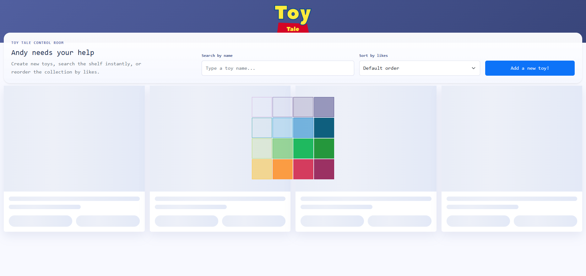

### Server has no data and starts seeding
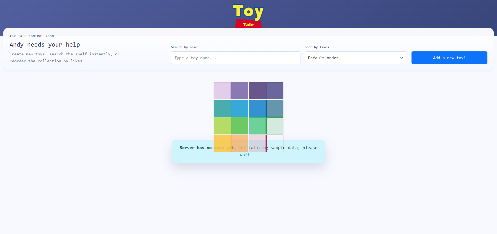

### Demo toys loaded
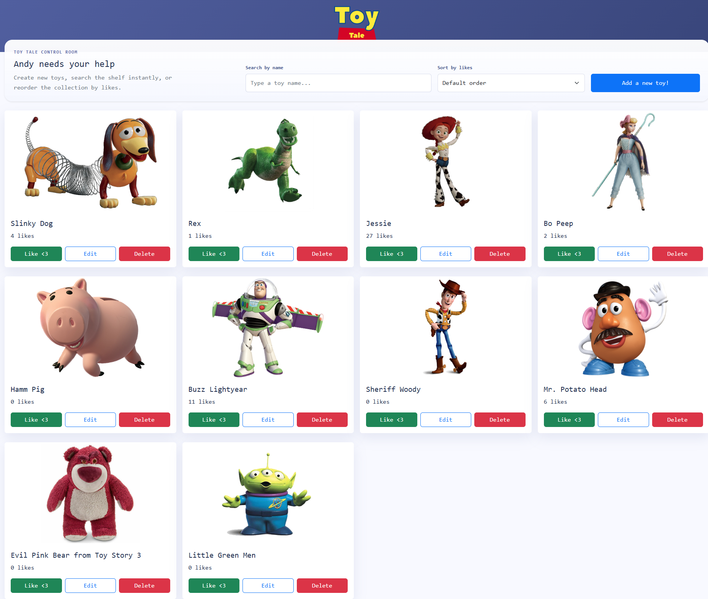

### API load failure state
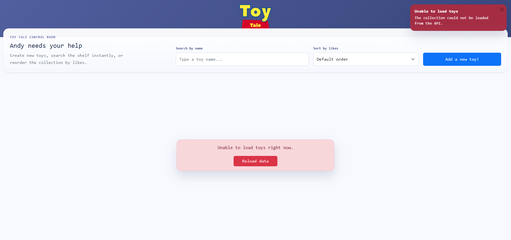

## Create flow

### Add form with valid public image URL
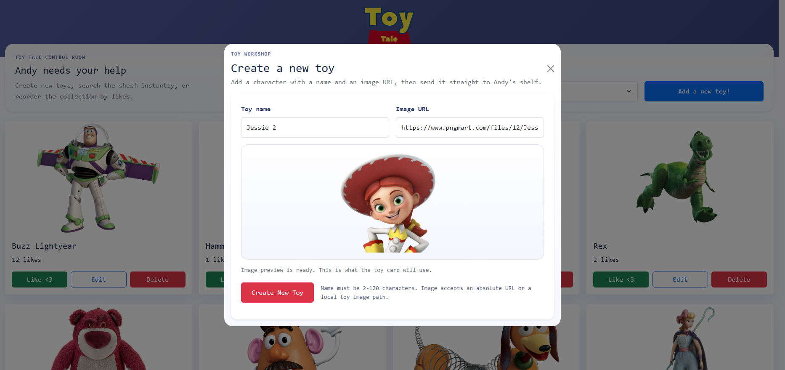

### Form validation errors
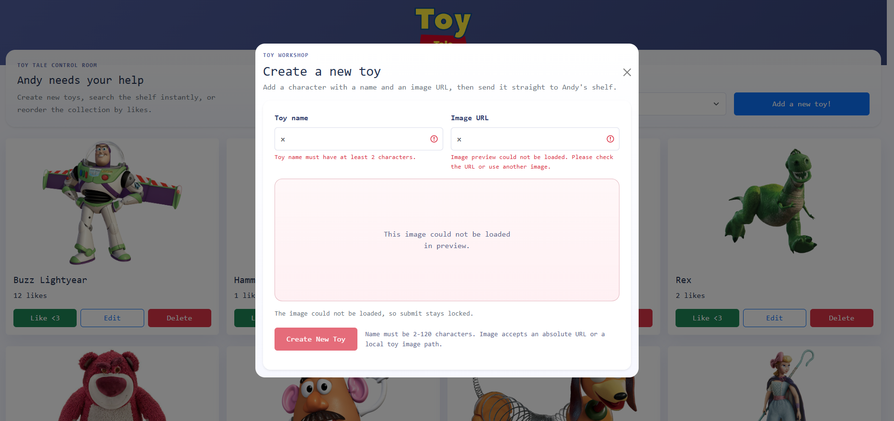

### Submitting create request
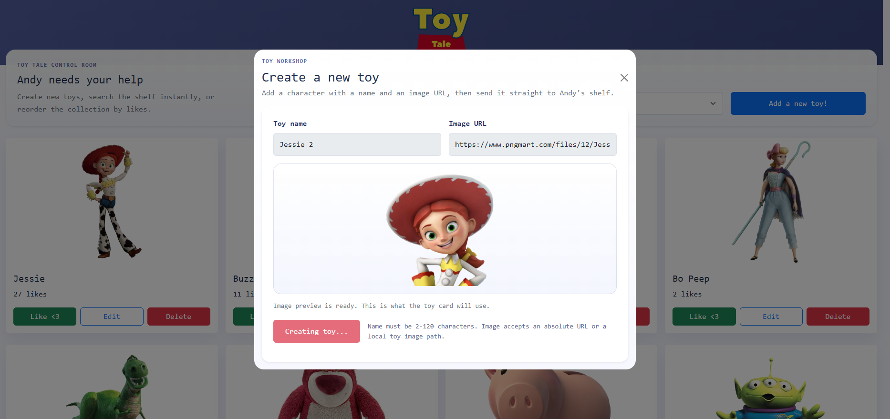

### Create success + toast
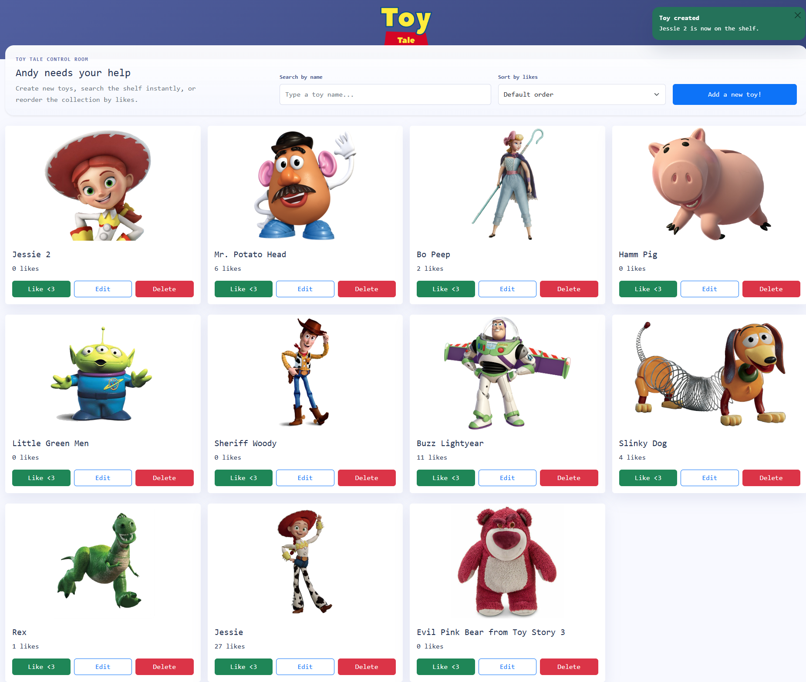

## Update flow

### Edit toy form
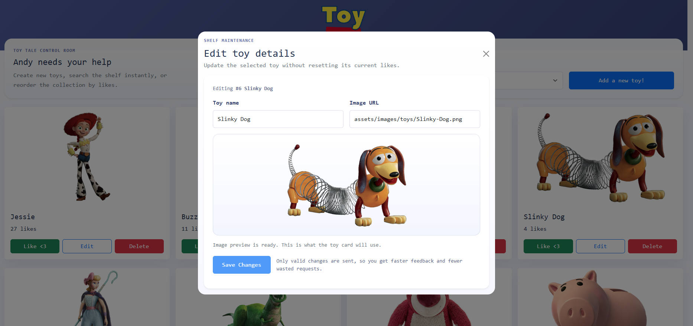

### Updating toy
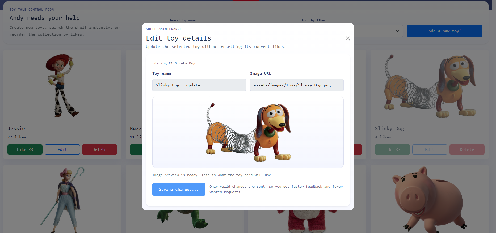

### Update success + toast
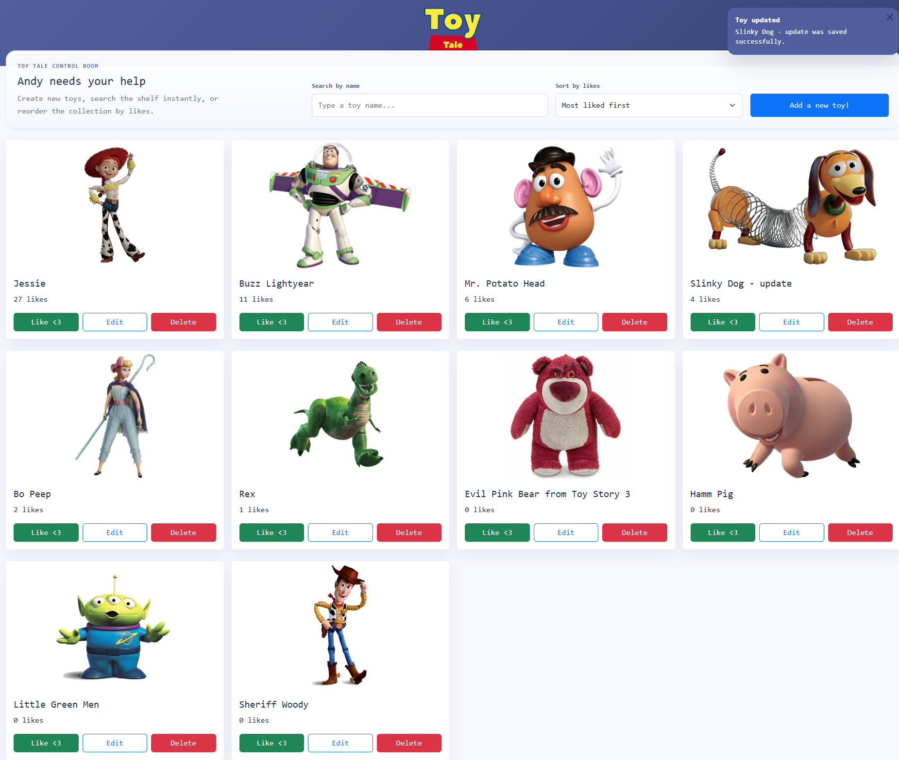

## Delete flow

### Delete confirmation modal
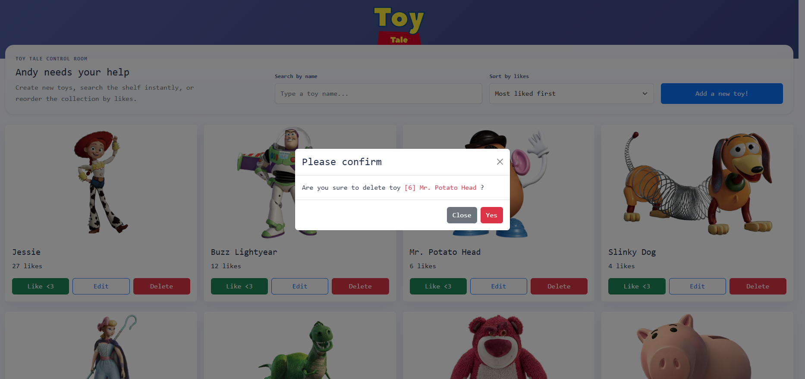

### Deleting state (busy modal and disabled controls)
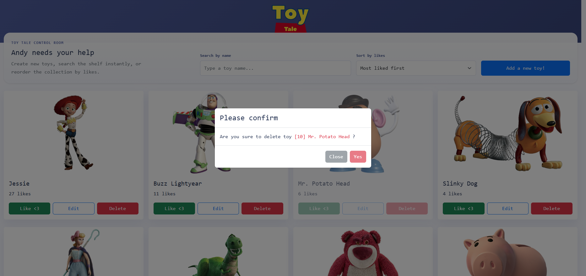

### Delete success + toast
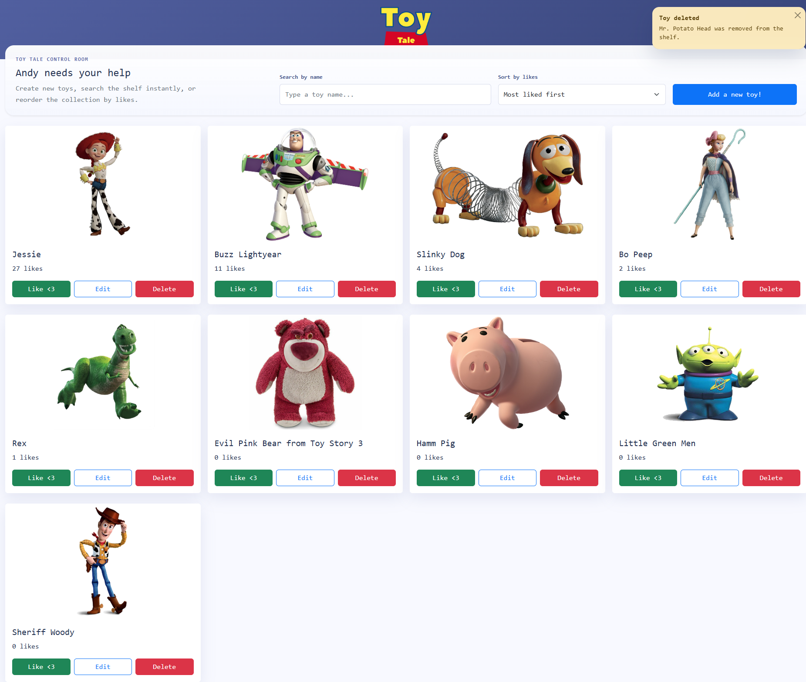

## Likes and sorting

### Like updates + stacked toast notifications
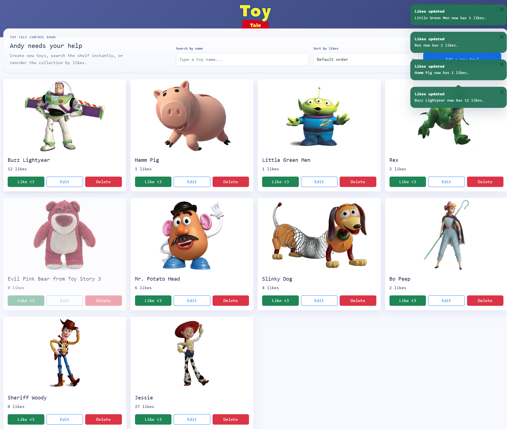

### Sort by likes
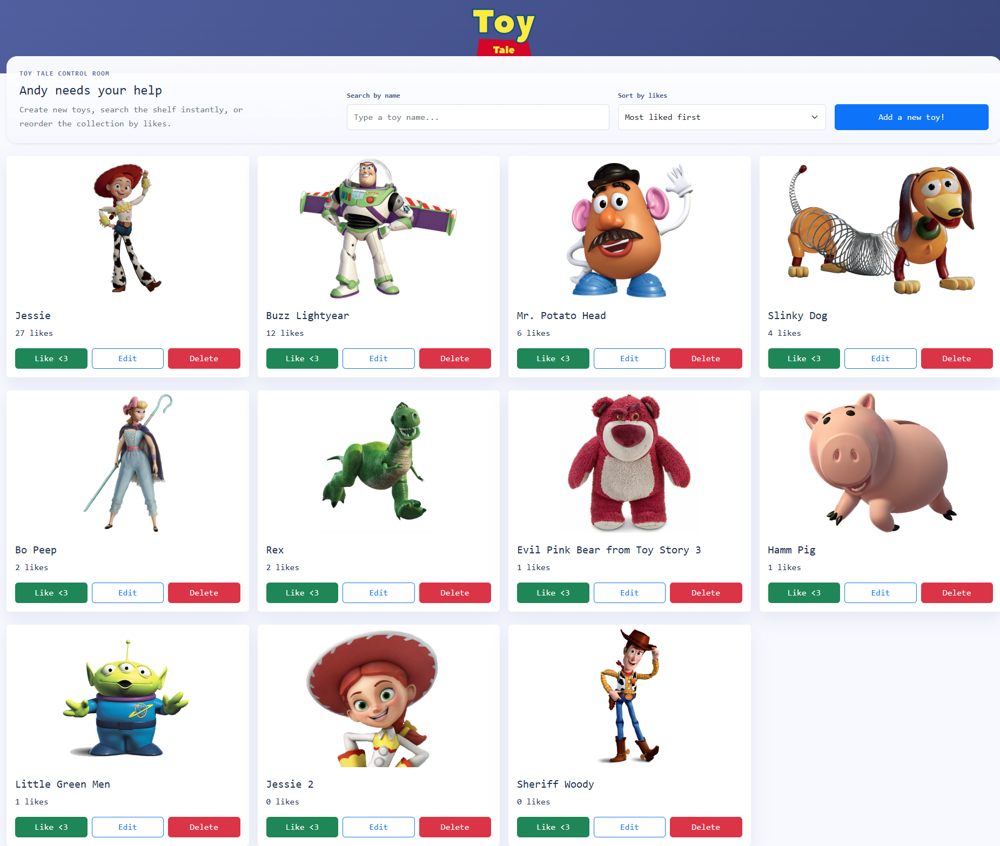
